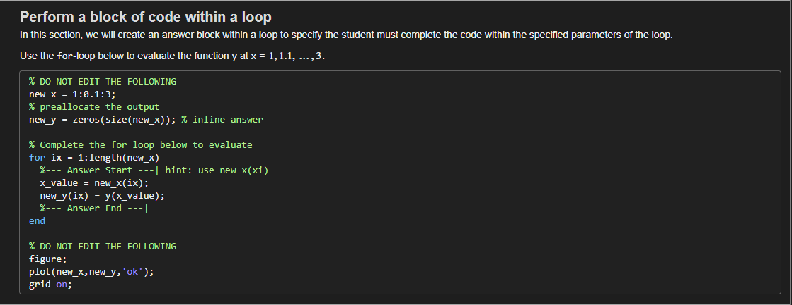
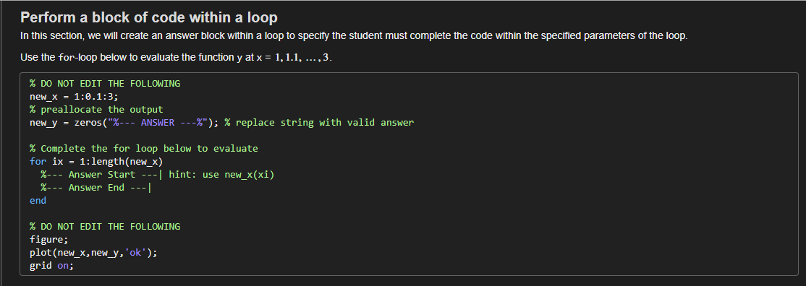

# LiveAssignmentBuilder

**LiveAssignmentBuilder** is a MATLAB utility designed to simplify the creation of live scripts for assignments, tasks, or instructional materials. It converts `.m` files into MATLAB live scripts (`.mlx`), automatically generating worksheets for students and answer keys for instructors, with clear indications for student responses. Additionally, it can create a table of contents with links to each generated live script and package the outputs for easy distribution.

## Features

- **Convert MATLAB Scripts**: Transforms MATLAB `.m` files into organized live scripts (`.mlx`) for both worksheets and answer keys.
- **Custom Parsing Syntax**: Supports custom syntax to separate answer blocks, sticky content, and areas for student input.
- **Build Table of Contents**: Automatically generates a CONTENTS live script that organizes and links all generated live scripts.
- **Packaging**: Packages the generated live scripts and contents into a ZIP file for easy distribution.
- **Configurable Options**: Allows customization of input files, output directories, inclusion of libraries, and more via various options.

## Installation

To use LiveAssignmentBuilder, download the repository and add the folder to your MATLAB path:

```matlab
addpath('path_to_LiveAssignmentBuilder');
```

## Usage

### Basic Syntax

```matlab
LiveAssignmentBuilder(inputFile, opts)
```

### Arguments

- `inputFile`: A string or array of strings specifying the input `.m` files to be parsed. If set to `"none"`, the function will parse all `.m` files in the specified root directory.
- `opts`: A structure of optional arguments.

### Options (`opts`)

- `root` (string, default: `"."`): Root directory where the input files are located.
- `output` (string, default: `"."`): Directory where the output files will be saved.
- `libs` (string, default: `""`): Path to additional libraries to include in the package.
- `verbose` (logical, default: `false`): If true, prints detailed progress and status messages.
- `package` (logical, default: `false`): If true, packages the generated outputs into a ZIP file.
- `buildContents` (logical, default: `false`): If true, generates a CONTENTS live script with links to all generated live scripts.
- `executeKey` (logical, default: `false`): If true, executes the generated key files to verify their functionality.

### Examples

#### Example 1: Basic Usage

Convert specific `.m` files into live scripts in the specified output directory:

```matlab
LiveAssignmentBuilder("file1.m", "file2.m", [[option]=...[,...]]);
```

#### Example 2: Build with Table of Contents

Build live scripts and generate a table of contents:

```matlab
LiveAssignmentBuilder(root = './assignments', buildContents= true, verbose= true);
```

#### Example 3: Package the Build

Generate live scripts and package them with additional libraries:

```matlab
LiveAssignmentBuilder("task1.m", output= './output_directory', libs= './path/to/libs', package= true));
```

## How It Works

**LiveAssignmentBuilder** uses MATLAB's built-in publishing tools along with custom parsing logic to manage the content for both students and instructors:
- **Sticky Blocks** (`%!`): Sections marked as non-editable for students.
- **Answer Blocks** (`%@`): Instructor-only content that is hidden in the student version.
- **Multiline Answer Blocks** (`%|@ ... %||@`): Sections where students are expected to provide answers.
- **Inline Answer Blocks** (`%<@ ... %>@`): Inline expressions for student answers or hidden solutions.

### Example Usage

In a script called `test.m`, we can write the following section:

```matlab
%% Perform a block of code within a loop
% In this section, we will create an answer block within a loop to specify the
% student must complete the code within the specified parameters of the loop.
%
% Use the |for|-loop below to evaluate the function |y| at 
% |x| = ${1,\, 1.1,\, \ldots,\,  3}$.
%

%!
new_x = 1:0.1:3;
% preallocate the output
new_y = zeros(%<@size(new_x)%>@);

% Complete the for loop below to evaluate 
for ix = 1:length(new_x)
  %|@ hint: use new_x(xi)
  x_value = new_x(ix);
  new_y(ix) = y(x_value);
  %||@
end

%!
figure;
plot(new_x,new_y,'ok');
grid on;
```


*Figure 1. Render of the MATLAB code in the KEY file: `test_key.mlx`.*


*Figure 2. Render of the MATLAB code in the WORKSHEET file: `test.mlx`.*

## Contribution and Support

Contributions are welcome to enhance LiveAssignmentBuilder. If you encounter any issues or have suggestions, please submit them via GitHub issues.

## License

This project is licensed under the MIT License - see the LICENSE file for more details.

## Versioning

This version (v0.0.1) was written on MATLAB 2022b and tested on 2024a.
